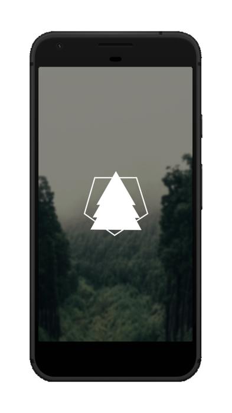

# The Sentinel Watcher

An Android Application made to record soundwaves, then interpret it and try to detect sounds of Chainsaw Machines running.

This application listens to ambient noise, by recording it. It then searches for the signature of a Chainsaw Machine. The implementation is really  simple and has only been tested to cover a small range of possible Chainsaw Sounds. It works by transforming the recorded sound through Fast Fourier Transformation (FFT), to extract it's frequence and  amplitude features. It then searches for peaks of amplitude (sound intensity) within the certain frequencies. When certain frequencies are detected, it then triggers a counter to check it again within a certain timeframe.

It is a part of TheSentinel Project and [is currently processed to be Patented](https://drive.google.com/file/d/1dCaDc7lMJvQZnYyE4Jc2mXdt05xm2XSz/view). Has been brought to an Indonesian National Wide Competition and acquired certain amounts of research grants.

The application is to be used within a certain for forest watching act. The full diagram can be seen within the Diagram picture.

